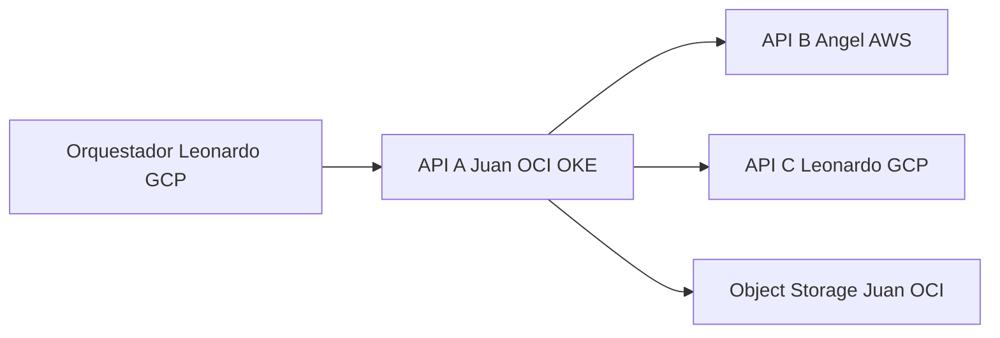

# Clic KiuSys PSS API

API REST para un mini PSS de aerolínea con las entidades **Vuelo**, **Pasajero** y **AsientoAsignado**.

Repositorio: https://github.com/juangz1912/clic_kiusys

## Arquitectura del grupo



| Integrante | Nube | Pieza |
|------------|------|--------|
| Juan José Giraldo | Oracle OCI | API A en OKE + Object Storage |
| Angel Avirama | AWS | API B adopción |
| Leonardo Giraldo | GCP | API C documentos + orquestador |

Servicios OCI usados: cluster OKE, registro OCIR, Load Balancer flexible (10 Mbps), Block Volume para Postgres, VCN y Object Storage. El DNS `sslip.io` apunta a la IP del balanceador sin costo.

URL pública: http://157-137-193-66.sslip.io

Caché y cola las llevan otros integrantes. El tablero SaaS del grupo se conecta después (`OTEL_EXPORTER_OTLP_ENDPOINT`).

| Integrante | Nube | Rol |
|------------|------|-----|
| Juan Jose Giraldo | **Oracle OCI (OKE)** | API A + Object Storage |
| Angel Avirama | **AWS** | API B — adopción ([Api_Pet_Adoption](https://github.com/AngelAvirama/Api_Pet_Adoption)) |
| Leonardo Giraldo | **GCP** | API C — documentos médicos ([MedicalDevops](https://github.com/LeonardoG2005/MedicalDevops)) |

- **API v2:** `/api/v2/health`, `POST /api/v2/flujo` (vínculos Animal–Vuelo–Imagen, Adoptante–Pasajero–NotaMedica, Adopcion–AsientoAsignado–DocumentoGenerado), `/api/v2/metrics`
- **Trace-id:** header `X-Trace-Id` en toda la cadena
- Guía detallada: [docs/GUIA_SEGUIMIENTO_2.md](docs/GUIA_SEGUIMIENTO_2.md)
- Integración del equipo: [docs/EQUIPO_INTEGRACION.md](docs/EQUIPO_INTEGRACION.md)

## Entidades (v1)

| Entidad | Descripción |
|---------|-------------|
| Vuelo | Inventario / schedule del vuelo |
| Pasajero | Perfil del pasajero |
| AsientoAsignado | Asignación de asiento con hold de 10 min |

Estados de asiento: `seleccionado`, `asignado`, `expirado`.

## Endpoints principales

- CRUD v1: `/api/vuelos`, `/api/pasajeros`, `/api/asientos-asignados`
- **QUERY:** `POST /api/vuelos/query`, etc.
- Health v1: `/api/health`
- **v2 multicloud:** `/api/v2/health`, `POST /api/v2/flujo`, `/api/v2/metrics`
- Docs: `/docs`

## Ambientes

| Ambiente | URL cloud | API local | Base de datos |
|----------|-----------|-----------|---------------|
| Pruebas (Render) | https://clic-kiusys-pruebas.onrender.com | http://localhost:8001 | postgres puerto 5433 |
| Producción (Render) | https://clic-kiusys-prod.onrender.com | http://localhost:8002 | postgres puerto 5434 |
| OKE (OCI, sa-bogota-1) | http://157-137-193-66.sslip.io | — | Postgres en cluster (block volume OCI) |

## Ejecución local

```bash
python -m venv .venv
source .venv/bin/activate
pip install -r requirements.txt
pytest --cov=app --cov-report=term-missing
docker compose up -d
python scripts/test_v2_endpoints.py http://localhost:8001
```

Variables Seguimiento #2: ver [.env.example](.env.example).

## Despliegue Render (Seguimiento #1)

El archivo `render.yaml` define 2 Web Services y **1 instancia PostgreSQL** con 2 bases (`pss_pruebas`, `pss_produccion`).

Secrets GitHub: `RENDER_DEPLOY_HOOK_PRUEBAS`, `RENDER_DEPLOY_HOOK_PRODUCCION`, `RENDER_API_KEY`.

## Despliegue OKE (Seguimiento #2)

Guía completa: [docs/OCI_DEPLOY.md](docs/OCI_DEPLOY.md)

```bash
cp scripts/oci/oci.env.example scripts/oci/oci.env   # completar y NO commitear
chmod +x scripts/oci/*.sh
./scripts/oci/deploy_all.sh
```

Plantilla para el equipo: [docs/EQUIPO_INTEGRACION.md](docs/EQUIPO_INTEGRACION.md)

## Pipelines

- `deploy-oke.yml` — en `main`: tests, imagen amd64 a OCIR y rollout en OKE
- `deploy-render.yml` — hook de Render en `develop` (pruebas) y `main` (producción)

## Stack

- Python 3.12 + FastAPI
- PostgreSQL
- Docker / OKE (Kubernetes)
- Render + **Oracle OCI**
- GitHub Actions

## Versionado

Ver [CHANGELOG.md](CHANGELOG.md). Release **v2.1.0** (Seguimiento #2 en OKE).
